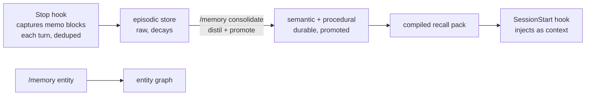

# ai-memory

[](https://github.com/ddmsolutions/ai-memory/actions/workflows/ci.yml)

Persistent memory for Claude Code. A bolt-on plugin that gives every session four kinds of memory, stored locally in SQLite, captured and recalled automatically through hooks.

Claude Code forgets everything between sessions. This plugin fixes that with a memory pipeline modelled on how human memory actually works:

| Type | What it holds | Example |
|------|---------------|---------|
| **Episodic** | What happened: events, outcomes, session summaries | "Migrated the billing tests to Vitest on 2026-08-25; 3 flaky tests quarantined" |
| **Semantic** | Durable facts about the user, the projects, the environment | "The staging DB is Postgres 16 on port 5433" |
| **Procedural** | How to work: lessons, rules, corrections that shape future behaviour | "Always run the schema linter before committing migrations" |
| **Entity** | A typed knowledge graph: people, projects, systems, and how they relate | "Alice (person) maintains (edge) payments-service (system)" |

## How it works



1. **Capture**: a Stop hook scans each turn for fenced memo blocks and writes them into the episodic store, deduplicated per session. Zero effort during the session.
2. **Consolidate**: a batch pass (`/memory consolidate`) distils raw episodes into durable semantic facts and procedural lessons, keeping the promotion lineage. Episodes decay; what matters gets promoted. The entity graph is maintained via `/memory entity` (automatic extraction is on the roadmap).
3. **Recall**: a SessionStart hook compiles a compact recall pack (pinned facts, top lessons, known facts) and injects it as context, so every new session starts already knowing you.

## Install

```bash
git clone https://github.com/ddmsolutions/ai-memory
cd ai-memory
python -m ai_memory init          # creates ~/.ai-memory/memory.db
```

Then add it as a Claude Code plugin, or wire the hooks directly into `.claude/settings.json` (see `docs/install.md`).

## CLI

```bash
python -m ai_memory remember --type semantic "Staging DB is Postgres 16 on port 5433"
python -m ai_memory remember --type procedural --pin "Run the schema linter before committing migrations"
python -m ai_memory search "postgres"
python -m ai_memory recall --task "database migration" --limit 10
python -m ai_memory entity add --name payments-service --etype system
python -m ai_memory entity link alice payments-service --rel maintains
python -m ai_memory consolidate
python -m ai_memory status
```

## Design principles

- **Local first**: one SQLite file, no server, no cloud, no API key required. Your memory never leaves your machine.
- **Plain text in, plain text out**: memories are readable rows, not opaque vectors. Search is FTS5; embeddings are an optional layer, never a requirement.
- **Decay by default, pin what matters**: episodic memory fades unless consolidation promotes it. Pinned memories never decay.
- **Corrections beat accumulation**: a memory can supersede an earlier one; recall always returns the latest truth.
- **Hooks do the work**: nothing depends on the model remembering to save. Capture and recall are wired into the session lifecycle.

## Status

v0.1: core store, CLI, and hook wiring. See `docs/roadmap.md` for what is next.

## License

MIT
