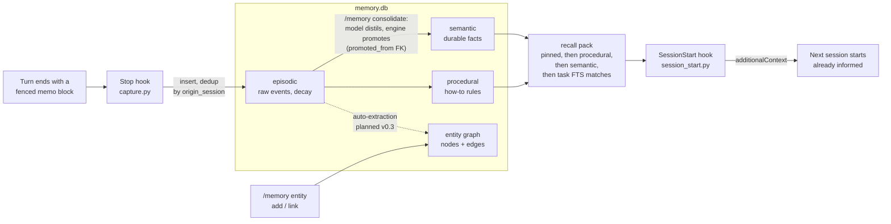
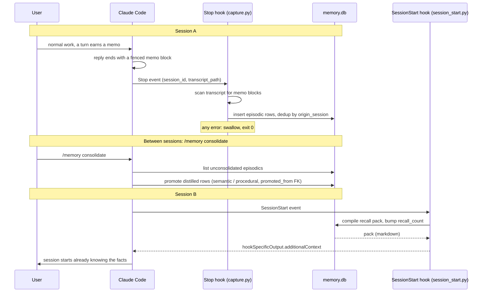

# Architecture

## The four memory types

Modelled on the standard cognitive split, because it maps cleanly onto what an agent actually needs between sessions:

- **Episodic**: raw, time-stamped records of what happened. Cheap to write, low individual value, high aggregate value. The only store that hooks write to automatically. Decays: an episodic row that is never promoted is eventually noise, and consolidation is allowed to ignore it.
- **Semantic**: durable facts, distilled from episodes or added directly. "The staging DB is Postgres 16." Facts can be superseded: a new row records `supersedes <old id>` and recall only ever returns the latest truth.
- **Procedural**: rules about how to work. "Run the schema linter before committing migrations." These are the highest-leverage memories: a handful of good procedural rows change behaviour in every future session, so recall gives them priority.
- **Entity**: a typed knowledge graph (nodes: person / project / system / thing; edges: typed, weighted, optionally evidenced by a memory row). Answers "who and what does this connect to" questions that flat text search cannot.

## Lifecycle



The hook interplay across two sessions:



- **Capture** is deliberately dumb: the Stop hook scans the transcript for fenced ` ```memo ` blocks and stores them verbatim as episodic rows, deduplicated per session. The intelligence lives in the model writing good memos, not in the hook.
- **Consolidation** is a model-driven pass (via the `/memory consolidate` command): list unconsolidated episodics, distil each into a standalone semantic fact or procedural rule, promote or discard. The CLI provides the primitives (`consolidate`, `promote`); the judgement is the model's.
- **Recall** is deterministic: pinned first, then procedural by confidence, then semantic, then task-relevant FTS matches, deduplicated, compiled into one compact markdown pack. Recall bumps `recall_count`, which feeds future ranking.

## Storage

Full data model, ER diagram and data dictionary: `data-architecture.md`. In brief: one SQLite file (`~/.ai-memory/memory.db`, override with `AI_MEMORY_DB`), three tables, three read views and an FTS5 index:

- `memories(id, type, scope, content, origin_session, promoted_from, confidence, pinned, consolidated, superseded_by, recall_count, last_recalled_at, created_at)`
- `entities(id, name, etype, summary)` with `UNIQUE(name, etype)`
- `edges(id, src, dst, rel, weight, memory_id)` with `UNIQUE(src, dst, rel)`

`scope` supports per-agent or per-project memory partitions later; everything defaults to `global` and recall for a scope always includes `global`.

## Design decisions

- **Stdlib only.** sqlite3 + FTS5 ships with Python. No dependency can rot, and install is a git clone.
- **Text search before vector search.** FTS5 covers the recall cases that matter at this scale. An embedding layer is a roadmap item, added behind the same `search` interface, never a requirement.
- **Fail soft everywhere.** Both hooks swallow every error and exit 0. A broken memory store must never block a session.
- **The model does the judgement, the engine does the bookkeeping.** Capture, dedup, ranking, decay bookkeeping are deterministic; writing good memos and distilling good facts is model work, prompted by the `/memory` command.
- **Third normal form, with one documented exception.** Provenance is atomic (`origin_session` for capture, `promoted_from` as a self-referencing foreign key for consolidation lineage), never an encoded string. `recall_count`/`last_recalled_at` are derived counters kept on the row deliberately: a fully-normalised `recall_events` table would add one insert per memory per session start with no query that needs the individual events. If usage metrics (roadmap) ever need per-event data, that table supersedes the counters.
