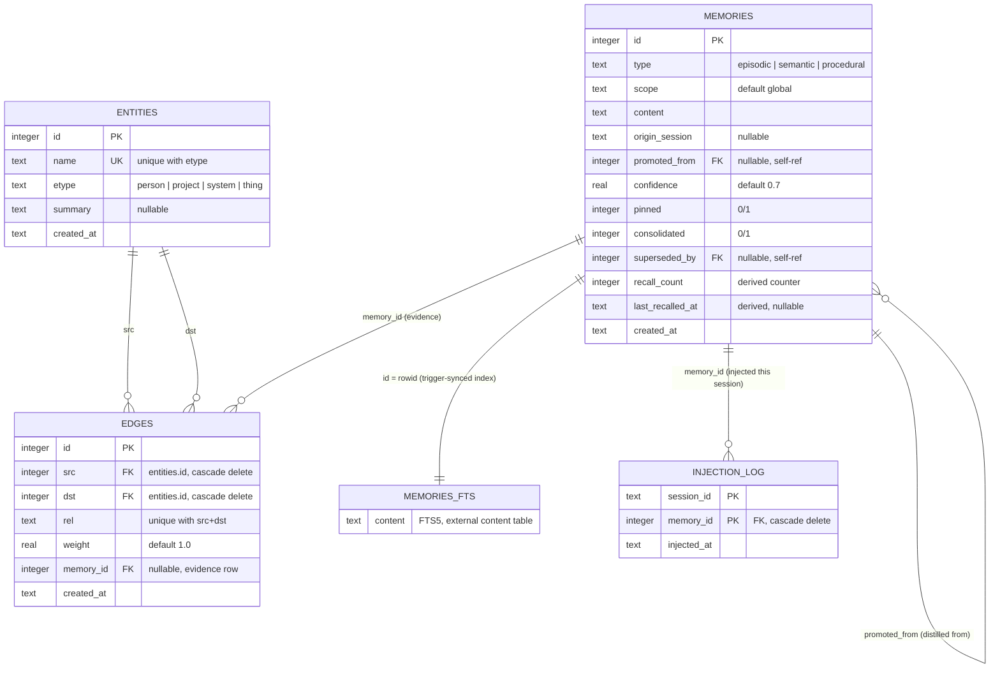
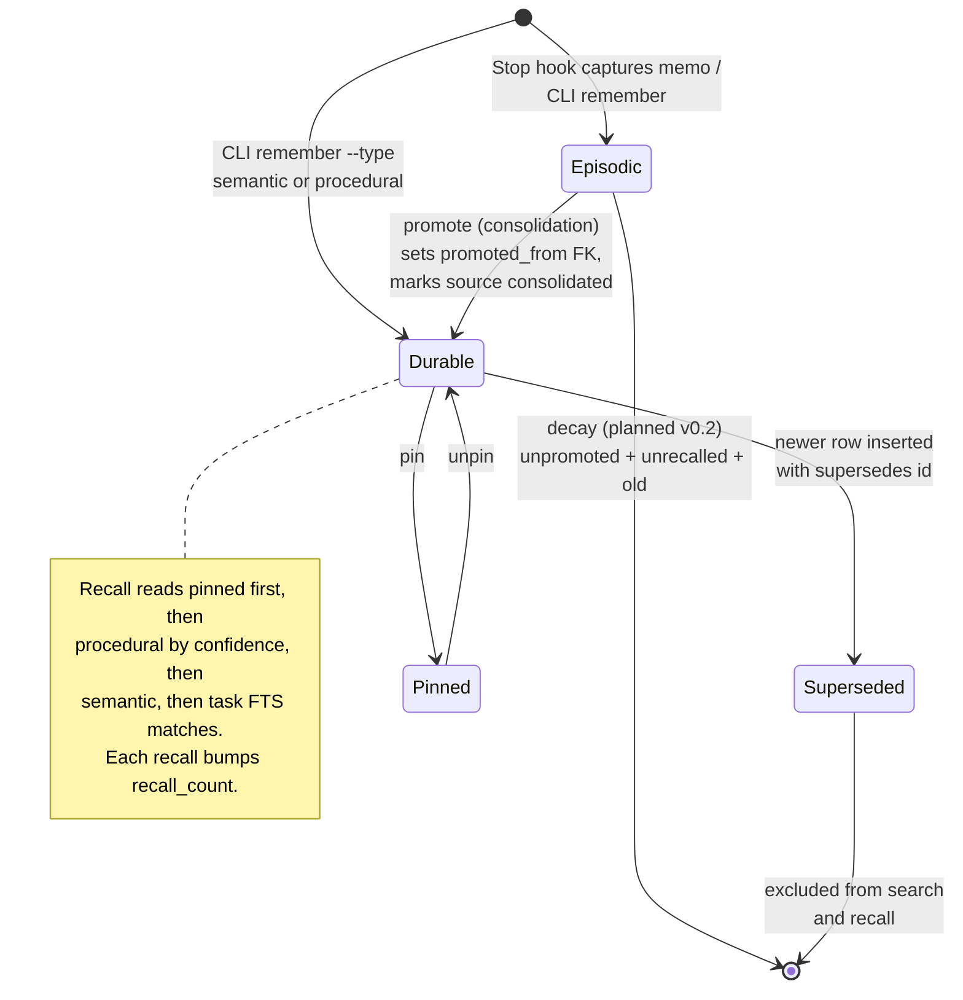

# Data architecture

The full data model for the ai-memory store. The executable source of truth is the DDL in `ai_memory/db.py`; this document is the human-readable view and MUST be updated in the same commit as any schema change.

One SQLite file (default `~/.ai-memory/memory.db`, override with `AI_MEMORY_DB`). Third normal form with one documented exception (derived recall counters, see Design notes).

## Entity-relationship diagram

## Memory row lifecycle

## Data dictionary

### memories

| Column | Type | Null | Default | Meaning |
|--------|------|------|---------|---------|
| id | INTEGER | PK | rowid | Surrogate key |
| type | TEXT | no | - | `episodic` (event), `semantic` (fact), `procedural` (rule). CHECK-constrained. |
| scope | TEXT | no | `global` | Memory partition. Recall for scope X always includes `global`. |
| content | TEXT | no | - | The memory itself, plain readable text. Never blobs. |
| origin_session | TEXT | yes | NULL | Session id that captured this row (Stop hook or `--session`). Dedup key per session. |
| promoted_from | INTEGER | yes | NULL | FK to the episodic row this durable memory was distilled from. ON DELETE SET NULL. |
| confidence | REAL | no | 0.7 | Ranking weight; promotion adds 0.1, capped at 1.0. |
| pinned | INTEGER | no | 0 | Pinned rows lead every recall pack and are exempt from decay. |
| consolidated | INTEGER | no | 0 | Episodic only: 1 once a consolidation pass has promoted or reviewed it. |
| superseded_by | INTEGER | yes | NULL | FK to the row that replaced this one. Non-NULL rows are excluded from search and recall. ON DELETE SET NULL. |
| recall_count | INTEGER | no | 0 | Derived counter: times included in a recall pack. |
| last_recalled_at | TEXT | yes | NULL | Derived: timestamp of last recall inclusion. |
| created_at | TEXT | no | now | ISO UTC. |

### entities

| Column | Type | Null | Default | Meaning |
|--------|------|------|---------|---------|
| id | INTEGER | PK | rowid | Surrogate key |
| name | TEXT | no | - | Display name. Candidate key with etype: `UNIQUE(name, etype)`. Lookup is case-insensitive. |
| etype | TEXT | no | `thing` | Node type: person, project, system, thing (open vocabulary). |
| summary | TEXT | yes | NULL | One-line description. Upsert keeps the latest non-null value. |
| created_at | TEXT | no | now | ISO UTC. |

### edges

| Column | Type | Null | Default | Meaning |
|--------|------|------|---------|---------|
| id | INTEGER | PK | rowid | Surrogate key |
| src | INTEGER | no | - | FK entities.id, ON DELETE CASCADE. |
| dst | INTEGER | no | - | FK entities.id, ON DELETE CASCADE. |
| rel | TEXT | no | - | Relationship verb (maintains, works_at...). Candidate key: `UNIQUE(src, dst, rel)`; upsert updates weight. |
| weight | REAL | no | 1.0 | Edge strength, orders neighbour listings. |
| memory_id | INTEGER | yes | NULL | FK to the memory row evidencing this edge. ON DELETE SET NULL. |
| created_at | TEXT | no | now | ISO UTC. |

### injection_log (schema v2)

| Column | Type | Null | Default | Meaning |
|--------|------|------|---------|---------|
| session_id | TEXT | PK | - | Claude Code session id |
| memory_id | INTEGER | PK | - | FK memories.id, ON DELETE CASCADE |
| injected_at | TEXT | no | now | When the row was injected |

Session-level injection dedup: a memory injected once in a session (session-start pack or turn-time recall) is never injected again that session (FR-R5). Added by migration 2.

### memories_fts

FTS5 virtual table over `memories.content` (external-content mode, `content_rowid = id`), kept in sync by three triggers (`memories_ai` / `memories_ad` / `memories_au`). It is an index, not a store: never write to it directly.

## Indexes

| Index | On | Serves |
|-------|----|--------|
| `idx_memories_type` | memories(type, consolidated) | Consolidation backlog listing |
| `idx_memories_origin_session` | memories(origin_session) | Capture dedup, the hottest query: runs on every Stop event |
| `idx_entities_name_nocase` | entities(name COLLATE NOCASE) | Case-insensitive entity lookup; the BINARY unique index cannot serve a NOCASE comparison |
| `idx_edges_src` / `idx_edges_dst` | edges(src) / edges(dst) | Neighbour queries in both directions |
| `memories_fts` | content | All free-text search and task-relevant recall |

Candidate-key uniques (`entities(name, etype)`, `edges(src, dst, rel)`) double as their lookup indexes. Tests assert via `EXPLAIN QUERY PLAN` that the two hot-path indexes are actually used.

## Views

| View | Definition | Purpose |
|------|-----------|---------|
| `v_active_memories` | memories where `superseded_by IS NULL` | THE read surface for current truth. Search and recall go through it; the exclusion of corrected rows is defined once, not repeated per query. |
| `v_consolidation_backlog` | active episodic rows with `consolidated = 0` | One definition of "what consolidation still owes", shared by `/memory consolidate` and `status`. |
| `v_edges_named` | edges joined to src/dst entity names and types | Human-readable graph inspection in one query; stable surface for the future `why` command and viewer. |

Views are read-only surfaces; all writes (insert, recall-counter bumps, supersession) go to the base tables.

## Design notes

- **3NF with one exception:** `recall_count` / `last_recalled_at` are derived aggregates kept on the row. A normalised `recall_events` table was rejected: one insert per memory per session start, and no current query needs the individual events. If per-event usage metrics land (roadmap), that table supersedes the counters.
- **Supersession over mutation:** corrections insert a new row pointing at the old one via `superseded_by`; history is preserved, reads only ever see the latest truth.
- **Foreign keys are enforced** (`PRAGMA foreign_keys = ON` on every connection); promotion lineage cannot dangle.
- **Schema versioning:** `PRAGMA user_version` stamps every store (baseline is 1). All DDL changes from v0.2 onward ship as entries in `db.MIGRATIONS`, applied in order inside an explicit transaction on connect; a failed migration rolls back completely and raises `MigrationError` (CLI fails loud, hooks fail soft). The earlier convention of relying on idempotent `IF NOT EXISTS` DDL is retired for versioned stores.
- **WAL journal mode** on every connection: hooks and CLI can touch the store concurrently (Stop fires per turn) without writer contention; `-wal`/`-shm` sidecar files are gitignored alongside the store.
- **Deletes are real:** `forget` removes the row (FTS trigger cleans the index; evidence FKs null out). The store holds personal data by design, so hard delete is a feature, not a risk.
